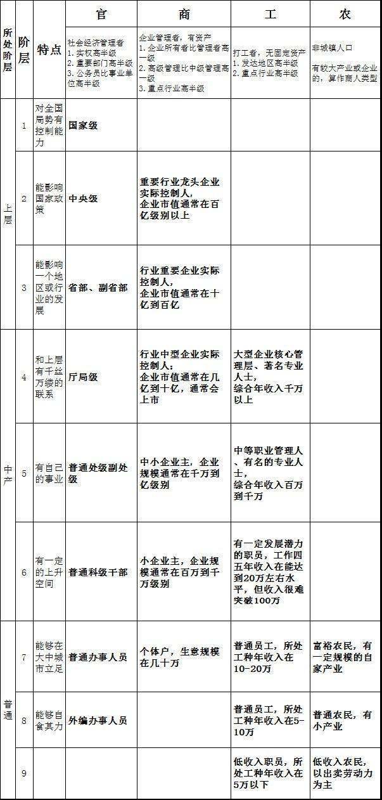

最近网络上出了一个中国社会最新的阶层划分模型，很有意思，先摘录并分析如下：

1 级：以在任委员、退休常委为代表，和 2 的区别在于，1 对全国局势有控制能力，2 没有。

2 级：以在任实权省部级干部、退休委员、部分大权贵、大富商、大银行家为代表。和 3 的区别在于，2 能影响国家政策，3 不能。

3 级：以一般省部、副省部、特别实权的局级，或是大企业主、一般权贵富商、名牌大学校长、中等银行家为代表。和 4 的区别在于，3 能够影响一个地区或者行业的发展，4 不能。3 以马云、马化腾等为体制外的顶峰，3 其实是行业精英或地区体制精英。1—3 级是中国的上层社会，普通人非奇遇不能进。

4 级：以一般地厅级、实权县处级、院士、大教授、高级职业经理人、名医生、名律师、高校校长、演艺明星、知名作家、中等企业主、小银行家之类为主。普通人通过奋斗最多能够达到这个层次。比如惠普谷歌大中国区总裁、范冰冰之类就是体制外本级的顶峰。4 和 5 的区别在于，4 和上层有千丝万缕的联系，5 没有。

5 级：以小企业主、普通处级副处级或实权科级干部、教授、中等职业经理人、大城市多套房地主、二三线明星、小有名气的医生、律师、工程师等。5 和 6 的区别在于，5 有自己的事业，6 没有。

6 级：以普通公务员、主流企业职员、高校青年教师、普通自由职业者、一般医生律师、一般工程师、大点的个体户等为主。名牌大学生、研究生毕业后多在这个层次。6 和 7 的区别在于，6 有一定的上升空间，7 很难。

4—6 级是中国的中层社会，分别是高、中、低端中产阶级，普通人通过努力，最后能够定格在第 5 级就算是很不错了。

7 级：以普通企业工人、边缘化的体制内人员、小个体户、城市底层土著、富裕农民之类为代表。7 和 8 的区别在于，7 能够在大中城市立足，8 不能。

8 级：以血汗工厂工人、普通农民等为代表。8 和 9 的区别在于，8 能够自食其力，9 不能。

9 级：以大城市底层失业人口、偏远山区农民等为代表，以城市的基本生活标准要求，这些人在城市基本不能自食其力。7—9 级是中国社会的底层，是草根阶层。

所谓金字塔型的社会结构，就是中层远小于底层，比如印度;纺缍型的社会，就是底层少中层多(上层哪儿都少)，比如美国。

需要特别说明的是，即使在同一级别，体制内与体制外不仅仅社会地位有很大差别，在其他政治、经济等各个层面也差别甚大。

毫无疑问，1—3 级是上层，是统治阶层，是最大的既得利益者，是可以从经济发展中切下最大蛋糕的阶层。而 4—6 级大致属于中产阶级。他们可以分享经济发展的成果，但是比例很小。其中，5 级是可以分享经济成果的最低阶层。很自然，6—9 就是贡献青春和劳动价值的人啦。尤其是 7—8 级，基本没有上升空间，在社会上也就混口饭吃，是绝对数量最大的一个人群。由于这个人群无法向上流动，只能向下流动，但是向下流动，只能流到 9 级，而 9 级数量过大则会影响社会稳定。

过去 20 年的历史表明，在现有的体制下，财富再分配方式只能在 4、5、6 与 7、8 之间展开，比如，提高最低工资标准，就是把 4、5、6 级的蛋糕分配一部分给 7、8。至于 1-3 任何时候都是最大的既得利益者，指望从 1-3 中切蛋糕来分配给 4-6 或者 7-8，那是绝对不可能的。至于印钞就更好玩了，这是  
1-3 级无条件对 4-8 级剪羊毛。

而社会阶层的固化，是金字塔结构的另一个重要的特征。在这样的社会结构里，个人奋斗远远不如人脉更重要。有一个好爹当然是最理想的，如果没有，靠钻营靠献身——或者说“我不要脸了”也有机会获得层面更高的人提携。无数事实证明，层面更高的人士提携比个人奋斗更容易爬到更高的阶层。5-6 级如果有 4 级体制内或者 3 级以上的人提携，很容易到达 4 级。7-8 级如果有 4 级以上的人提携，也很容易到达 5-6 级。总体上来说，7-8 阶层是没有希望的阶层，即使有个什么机遇，他们也没有人脉和资金来把握这个机遇。而 9 级是这个社会最悲惨的阶层，这个阶层没有任何福利，收入很低甚至为 0，如果在城市只能啃老，在农村只能苟延残喘。

请对照一下，看看你自己目前隶属于哪一级;通过努力，将来有希望上升到哪一级;遭遇失业，不幸会下降到哪一级。想清楚了，或许能更好地帮助自己做好各种人生规划，包括职业、理财与保险。

至于所有 P 民们寄予厚望的改革，公报大家都可以看，就是继续小心地骑自行车，绝对没有赶紧换成汽车的意思。如果有什么病，吃点药是必须的，但最好是不打针，至于做手术，那就别想了。

因为 1-3 要的是维稳，4 级改革的欲望也很低。5-6 阶层是创业和改革热情最高的阶层，但绝对没有话语权。

知道 GDP 为什么要保 8 吗?保增长保就业，真正的原因是要保证第 8 级的人群不能掉进第 9 级。哈哈。现在这个目标调整为 7.5——意思就是至少要保证 8 级中有一半的人不掉进 9。至于底限是 7，意思是如果保不住 8 级，也不允许 7 级掉入 9。

这一分法和下面这张图很像，这张图是依据春秋时期著名的政治家管仲所提出的士农工商 4 种人划分的中国各阶层图，我们每个人都可以在这张图里找到自己目前所处的位置。

=================全球档案博客\*分享拥有价值===================

精英们为什么喜欢西方制度?

作者：尹国明

一、先了解一下什么是中国的精英

首先要对精英这个本来充满褒义的词汇表示哀悼，因为中国所谓具有精英意识或者以精英自居的人的表现，彻底的改变了人们对“精英”一词的理解，在人民的心里，精英这个词汇的褒义已死，必须哀悼。**现阶段，一提起精英，很多人就会联想起那些推崇资本主义私有制、喜欢多党制和三权分立为基本特征的西方政治制度的民主精英们。这些人包括主流经济学家、著名法学教授、各种各样的学者专家教授在内的“英雄群体”，** 三十年来活跃于主流媒体、荧光灯下，给我们奉献了很多精彩语录，经常让老百姓们瞠目结舌。我们要认识中国的精英都是一些什么玩意，先从学习领会精英的精彩语录开始：

希望布什学习里根，里根是最伟大的总统，在他的任期消灭了社会主义国家——苏联，希望布什能在他的任期消灭社会主义国家——中国。————余杰

改革在中国造就了约占总人口 5%左右的富人，他们是中国的中坚力量，而另外的 95%中的很大部分，则因为信仰毛泽东思想，具有很大的破坏性。——-茅于轼

香港一百年殖民地变成今天这样，中国那么大，当然需要三百年殖民地，才会变成今天香港这样，三百年够不够，我还有怀疑。——-刘//晓//波

贫穷是罪恶。……如果一个人活成了下层人，那就是活得最失败的人，被淘汰的人，有什么可表扬的呢?——李银河

中国的贫富差距还不够大，只有拉大差距，社会才能进步，和谐社会才能有希望。中国穷人为什么穷，因为他们都有仇富心理。我要为富人说话，不是为了讨好富人。今天有些人骂富人，好像是给穷人出气，其实他们是害了穷人。杀富济不了贫，穷人应该将富人看成自己的大哥，大哥穿新衣小弟穿旧衣，天经地义。  
————厉以宁

在改革过程中，国有资产的流失是必然的，不必大惊小怪为了达到改革的目标，必须牺牲一代人，这一代人就是 3000 万老工人。八亿多农民和下岗工人是中国巨大的财富，没有他们的辛苦哪有少数人的享乐，他们的存在和维持现在的状态是很有必要的。——厉以宁

现在已经全球化了，没有必要再提什么民族经济民族产业了，义和团思想才是中国真正的大敌。——-龙永图

国有企业迟早要卖。既然如此，得先卖效益好的，不然，以后效益不好就没人要了。——樊纲(中国国民经济研究所所长)

腐败和贿赂成为权力和利益转移及再分配的一个可行的途径和桥梁，是改革过程得以顺利进行的润滑剂，在这方面的花费，实际上是走向市场经济的买路钱，构成改革的成本费。——张曙光(北京天则经济研究所理事长)

在公有制下，官员索取剩余可能是一个帕累托改进;因为它有利于降低监督成本，调动官员的积极性。私人产品腐败的存在，对社会、经济发展来说即使不是最好的，也是次优的。第二好的。——张维迎

这就是中国的改革精英的精彩语录中的一部分，限于篇幅，更多精英的更多精彩语录，无法一一列举。精英嘛，自称学富五车、著作等身，说的话要一般人都听不懂方能显示其非同一般人，而且我相信，人类的正常智商和正常思维是无法从字面来理解这些话的。要做民主精英，必须把简单的话说的复杂才行，说的鬼都听不懂的时候，那就可以以精英自居了。

**说精英的话不好懂，是因为你没有站在精英的立场和角度。其实，要想理解精英这些话的深刻含义，只要把握一条原则，马上就可以醍醐灌顶，就能够实现和精英的心灵相通。樊纲说过一句话：经济学家就是为利益集团服务的。** 樊纲还是好同志，能说真话，这句话可以作为我们理解精英语录的钥匙，也是我们确定精英立场的重要依据。

精英心目中的利益集团是既得利益集团，既然是为既得利益集团说话，那么精英自然不会为不属于既得利益集团的以工农为主体的人口大多数说话。茅于轼的话更精确的采用量化的方式来表达了精英的价值趋向：他们是为改革中先富起来的占总 5%左右的富人的利益代言的，在他们心里，这 5%才是中国的中坚力量，而另外的 95%就是这些精英心里的 P 民，其中很大一部分因为信仰毛泽东思想，他们认为具有很大的破坏性，属于这些精英心里的“暴民”。

厉大师说的更明白：只有损害几亿工人和农民的利益才能让少数人富起来。这些精英中的很多人或者为改革做舆论准备，或者直接参与了改革方案的设计或研讨，既然他们承认为占人口 5%的既得利益者做利益代言人，那么精英参与设计的改革方案，在利益平衡中，自然会优先考虑 5%的富人的利益，而另外 95%的大多数的利益是必须从属于利益集团的利益最大化的前提之下的。这就可以解释为什么精英参与的改革方案，总是让老百姓感觉失落，5%的先富者的利益至上，与毛时代总是强调 95%的大多数人的利益趋向原则正好颠倒。原来奥秘都在精英的经典语录里隐藏着呢，就是为了让少数人富起来，让大多数人成为永远的待富者。

**明白了精英们的价值趋向，搞清楚了精英的为 5%富人利益代言的立场，我们就不难理解为什么公有制企业改为国有、国有制企业改为私有、住房货币化、医疗市场化、教育产业化这些改革的重点领域都洒下了精英辛勤的汗水，凡是制造贫富悬殊、剥光老百姓福利的改革方案中都有这些精英闪烁的身影。** 我国的改革进行到今天，创造了超过美国的贫富悬殊和财富集中度，精英的功劳不可磨灭。

搞清楚了，**中国的精英们就是这么一些玩意，他们是中国既得利益集团的代言人，是为中国 5%的富人服务的，他们不管是具体为哪个既得利益集团服务的，但是肯定不会为占人口最大多数的工农大众的利益代言。  
**

二、精英传销西方政治制度又是为谁的利益代言呢?

精英们一直呼吁推进中国的政治体制改革，精英们很聪明，他们从来不承认改革造成的贫富悬殊等诸多社会问题是改革的方向和价值趋向上出现了问题，他们精明的将问题归结于政治体制改革的滞后。为解决改革中出现的问题，精英们又开出了两个药方：一个是改革出现的问题要靠深化改革来解决，另一个是要推进政治体制改革。精英们承认问题存在，但是不承认问题根源在于改革的价值趋向和利益平衡上出了问题，甚至他们要充分利用改革出现的各种严重和社会矛盾，利用他们的话语权，进一步把中国引向政治经济思想文化全盘西化的道路上。制造问题、制造危机也是精英们曲线实现全盘西化目标的手段，正如为了实现公有制企业改制为私有的目标，就必须把企业经营的亏损乃至账面资不抵债的手法异曲同工改变。精英此计甚毒啊!

精英们的政治体制改革从他们炮制的 08 宪章就可以看的一目了然，他们的政治改革目标，就是否定中国共产党领导下的人民代表大会制度和多党政治协商制度，将新中国建立的政治框架全部推倒，在中国实行多党制和所谓的三权分立制度。

**精英们为何如此锲而不舍的追求西方政体呢？是为了谁的利益呢？政治体现了经济的客观要求，精英已经公开承认他们是为占中国人口 5%既得利益集团服务的，既然精英在经济上是为 5%的富人服务的，在政治上自然也是 5%的权贵们做代言人，他们支持的政治体制改革，自然不会是为了占中国人口的另外 95%的利益。精英的政治利益价值趋向和经济利益价值趋向当然是一致的，还是为了经济体制改革中获利的那 5%的人口着想。5%的人的利益优先，恰恰戳穿了西方政治制度的民主遮羞布。** 分析至此，我们下一个要分析的问题自然是西方政治制度的价值取向问题。

三、**为什么多党制和三权分立的西方政治体制最符合占人口 5%的既得利益集团的利益呢？  
**

私有制必然导致贫富悬殊，这是理论和实践中一再证明的事实。贫富悬殊问题不仅存在于贫穷国家，发达国家也面对同样问题，经济合作组织(OECD)一份研究报告 21 日指，发达国家的贫富悬殊问题在过去 20 年有恶化趋势，即有钱人愈有钱，穷人愈穷，而且面对贫穷风险高危人士，由老年人转移至儿童和年青人身上，加剧儿童贫穷问题。经合组织 21 日公布长达 309 页、题为《不平等增长：OECD 国家的收入分配及贫穷问题》的报告，归纳 24 个国家的数据显示，过去  
20 年的经济增长有利富有人士多于穷人，令 3/4 成员国的贫富距离拉阔，贫富差距累积增加 7%。最富有一成人的平均收入是最穷一成人约 9 倍。

而集中占有社会财富的少数人与占人口多数的多数人之间的矛盾，就是阶级矛盾，一直贯穿于私有制社会的始终。社会财富集中于少数人之手，意味着资源分配的绝对不公平，这本身就与民主体现的多数人的利益至上相悖，从这个意义而言，**私有制和民主之间是完全冲突而不能兼容的。民主意味着多数人对少数人的统治，人数上处于于绝对劣势的有产阶级对民主是持有天生的恐惧，在他们眼中，民主是多数人对少数人的暴政。** 进入资本主义社会之后，随着民主意识的逐渐苏醒，社会大众对于民主的要求是不可遏制的，这令垄断社会财富的少数富人更是日生恐惧。在这种情况下，就需要设计一种政体，来防止真正的民主，防止有钱人视为洪水猛兽的多数人的暴政出现。迄今为止，所有资本主义的宪法都是有钱人为主来参与制定的，根据民主精英反复渲染的人性自私论，富人或者富人的代理人制定的法律不可能对多数人有利，也就是说不可能体现民主。

中国的民主精英们心目中的民主的典范国家就是美国，美国的宪法也是他们崇拜至极的一部所谓的民主宪法。那我们就先从美国宪法开始进行实例分析。与精英的忽悠不同，美国的宪法其实就是一部拒绝和预防民主的宪法，制宪者们均为当时的有产者，参加费城制宪会议的 54 名代表中，拥有巨额数量地产的超过 14 人，新兴工商业巨子超过 35 人(有重叠现象)。为了把人民排斥于制宪会议之外，当时的美国精英设计了一套与个人财产相联系的选举制度，立宪会议的代由各州议会指派，而不是由各州经选举产生。为进一步限定公众的参与，各州于 1787 年实施了关于投票人和州议员的财产限制。规定只有具备一定数额的财产的人才有任投票人以及州议员的资格。美国宪法制定者、前联邦总统麦迪逊就对制订宪法的原因和目的说的就很透彻：“多数人终会变成无产者的国家里，有产者的财产权在本质上是脆弱的。”，“这种脆弱性成了制宪者们对多数人暴政威胁关注的焦点”，于是，“制宪者的基本任务就是设计一种基于共和原则但又确保少数人的财产安全的政府形式”。詹妮弗·内德尔斯基在《美国宪政与私有财产权的悖论》也说：“制宪者们对财产权的保护问题的专注，是他们的某些最深刻的见解的渊源，也是宪法的主要力量和最严重的弱点的渊源。”制订美国宪法所要解决的核心问题是保证不因多数人的民主来侵害少数有产者的财产，少数人的财产利益至上才是美国宪法的首要价值追求。

美国宪法的的制订既然确立了少数富人利益至上原则，那么在具体的制度设计上自然就要体现这一原则：美国把行政权集于总统一人，赋予总统很大的权力，所以美国的总统制被称为选举出来的君主制;设置参众两院，参议员由间接选举产生(1913 年之后改为直接选举)，任期 6 年，并实行高额财产资格的限制(后取消)，参议院体现了贵族精英的民主。参议院在诸多权限上要高于众议院。参议院与总统联合享有缔约权、总统行政官员的委任、总统对最高法院法官的任命也须得到参议院的批准，参议院还享有审议总统弹劾案的职权。这种权限设置是为了“在共和政体中，立法权必然处于支配地位。补救这个不便的方法是把立法机关分为不同单位，并且用不同的选举方式和不同的行动原则使它们在共同作用的性质以及对社会的共同依赖方面所容许的范围内彼此尽可能少发生联系”，也就是设置类似于贵族院的参议院去限制更多体现民意的众议院，防止出现大多数人的意志足以损害少数富人财产权的现象出现。

后来随着垄断的日益加剧，金融寡头对资本和媒体的控制更为强大，同时采取了间接控制和幕后操纵的方式，通过对竞选资金和媒体两个方面的日益牢固的控制，就可以基本控制参议员是代表垄断资本利益的人，在这种情况下，逐渐放松了对参议员的财产资格额限制。正如美国宪政评论家所说：“新宪法确立的四种主要决策实体(众议院、参议院、总统、最高法院)中，民众只有权选一种。其他三种的选举至少要两度远离民众控制。”美国的分权机制是为了限制大多数人的民主权力发挥作用的渠道。美国的历史学家们评论的更是一针见血：“制宪者们设立参议院的目的是不仅要它代表各州的利益，而且要代表‘富人和贵族’(汉密尔顿语)的利益，而不是‘大众’的利益。”、“开国者们还企图在国民政府中实施一种分权制，即独立的立法、行政和司法部门，以将其作为一种对付多数主义(民众多数政治)的防御工具和作为一种保护精英自由和财产的补充手段。”说白了，**美国的三权分立的目的不是为了民主，而是为了防止民众的力量冲刷少数富人的财产和利益，是为了预防民主的。  
**

**垄断资本的本质追求是攫取最大利润，这是资本的唯一使命。资本参与政治，操控选举乃至渗透公权力当中，都是服从于资本的这个根本目标的。** 仅仅有了三权分立的政治架构还不够，还需要一个与此相适应的政党体制来适应，这就是多党制。资本主义的多党制奥秘就体现于于美国前总统杜鲁门一句道破天机的话：美国的两党制是“两党合作制”。两党既然能够合作，前提是两党的政治纲领在重大原则问题上的一致性。试想，如果一个政党要搞资本主义，另一个政党要搞社会主义，那就无法形成两党合作制。美国的共和党和民主党是美国主要的两大政党，两党都坚持资本主义价值观、都要维护资本主义私有制的经济制度和资产阶级专制的政治制度。每次总统大选，美国很多资本集团都两边押注，这也说明两党的政治纲领与垄断资本的利益都无冲突。而对于与垄断资本利益存在冲突的美国共产党，美国曾经运动国家机器的力量进行过疯狂镇压。

**西方的多党制大多数是体现为两党主导的政党格局，** **基本也就是杜鲁门所说的两党合作制，也就是名义的两党，实质的一党制。所以西方政治的多党制其实就是一党制。实质的一党，却非要表面上设计为名义的多党也是有精心考虑的：一个考虑是防止一个政治派别独大，最终会变得不好控制，多个政党竞争，掌握资本的垄断资本集团通过控制资金和媒体，就可以分而治之，最有利于控制；另一个考虑是，表面的多党可以迷惑选民，让选民对少数人执政的愤怒通过多党轮流借以缓解。  
**

**　美国是当今西方政体的代表，其他西方民主政体与美国大同小异。都是体现为金权高高在上，居高临下的控制着三权，通过分权与制衡来防止他们心目中的“多数人的暴政”出现。在垄断资本和利益集团眼中，谁危及他们的利益谁就是暴民，无论是代表人口的多数还是少数。  
**

四、判断是否民主的一个简化的标志就是精英支持的绝对不是民主，精英反对的、符合大多数人利益的才可能是民主。

在中国的既得利益集团和精英眼中，也是视占人口大多数的民众如洪水，他们最怕的就是占人口 90%以上的民众醒悟团结起来，那样只占人口极少数的既得利益集团和精英就彻底处于劣势。只有让民众因为不同观点不同理论陷入纷争和内斗，才能最大程度的削弱占人口大多数的民众的力量。让民众陷入分裂，互不信任甚至互相内斗，才是掌握社会财富的少数人能够继续维持对多数人统治的必要前提。这个原理和垄断资本集团热衷于搞多党制和三权分立的原因是异曲同工的。为了达到分化民众的目的，就必须先推销价值多元，摧毁不利于资本利益的社会主义价值观和马列主义信仰，然后以有利于资本利益的资本主义价值观来替代。在中国，毛泽东思想就是马列主义的中国化，中华民族经过一百多年的一盘散沙局面，终于在毛泽东思想指导下，重新变得有凝聚力。一个有凝聚力的人民是既得利益集团和精英最为惧怕的，也是西方反华势力削弱中国的最大障碍。这也是为什么三十年以来，那么多精英竭力诋毁毛泽东、毛时代和毛泽东思想的根本原因。

中国的既得利益集团已经在经济体制改革过程中，完成了财富的积累和集中，最需要的就是如果通过设计新的政治制度来保护获取的非法利益不被人民清算，保护私有财产不被多数人团结起来形成的力量冲垮。根据我们前面对美国宪法和美国体制的分析，既得利益集团和他们的代言人民主精英们，自然对美国为代表的西方制度孜孜以求。**既然在经济上，精英代表的是 5%左右的富人的利益，那么在政治上他们也是代表这部分富人的利益。从这个角度来说，精英认可的，恰恰就是对占 95%人口的人民大众所不利的；精英们反对和仇视的，恰恰就是对人民大众有利的。** 在精英已经不打自招其代表 5%富人的利益的情况下，判断是否民主的标志就简化了。那就是精英支持的肯定不是民主，精英反对的反倒有可能是民主。

既然精英们对毛时代咬牙切齿，那么我们就要好好分析毛时代到底是体现民主还是体现专制。如果毛时代是代表占人口少数的既得利益集团和精英的利益，那么这些民主精英是不会反对和仇视的，正因为精英如此仇视如此诋毁毛时代，反倒说明毛时代的社会主义实践肯定是反映了社会绝大多数人的利益，同时也说明毛时代才是真正的人民民主。这应该是一个合乎逻辑的推断。

五、那么毛时代是如何体现最大多数人的利益的呢?

首先毛时代有一个能够反映最大多数人利益的公有制的经济基础。公有制就是众多社会成员共同占有生产资料的所有制形式，改变了私有制社会生产资料归少数人所有的不公平状态，与此相适应，在公有制基础上实行按劳分配为主的分配方式，最大程度的兼顾了公平和效率，这样就形成了一个公平分配社会资源的经济机制。公有制也为实现经济民主垫定了基础，公有制企业客观上要求必须实行民主化管理，毛时代的鞍钢宪法，就是公有制企业民主化管理的一个成功创造新。当然，毛时代毕竟是出于从农业国家向工业国家转变的特殊时期，工业化过程是经济转型的最痛苦时期，在工业化未完成之前，必须依靠农业对工业的支持，工业本身也需要把更多的产出用于再生产。这就必然带来工农的暂时差别和消费的人为抑制。所以从感觉上，毛时代的消费水平不高，恰恰是因为牺牲了一代人的消费，来尽快的实现工业化，为后代人尽快的提高生活水平作付出和贡献。

其实，毛时代探索了社会主义大众民主，是人民群众广泛参与享有广泛权力的人民民主。毛时代的民主实践在中国历史上第一次采用大众民主来代替精英政治，第一次让人民大众作为权利主体真正的开始享受当家作主的权利，第一次让几千年来一直居于社会最下层的工农地位不再在精英面前保持卑微姿态，第一次让权力直接受到群众的监督、让官权受到民权的直接制约、成功的遏制了腐败，第一次实现了多数人对少数人的专政、让人类自进入私有制社会以来就存在的金字塔社会结构发生倒转。

六、中国的政治体制改革应该是社会主义政治体制的改革的完善。

新中国建立的政治体制是最反映民主要求的民主政体。新中国的政治体制的基本特征是一党领导下的多党合作制度、人民代表大会制度，体现的是民主集中制的原则。就多党协商制度而言，本身是个很天才的制度设计，既通过保证了一党领导来确保国家意志的集中统一，又通过多党协商进行政党之间的监督和合作。就人民代表大会制度而言，基层人民代表大会代表由选民直接选举产生，以上各级人民代表大会代表由下一级人民代表大会间接选举产生。人民代表大会是国家的最高权力机关，国家行政机关、审判机关、检察机关由人民代表大会产生，对它负责、受它监督，是实行议行合一基本活动原则的的全权性权力机关。这样的设置最体现民意代表机构是权力来源的民主性要求。而美国那样的三权分立却将最能体现民意的代议机构置于选举产生的君主的制约之下，本身就是对民主原则的背离。

人民代表大会制是适合社会主义的根本政治制度，是以公有制为经济制度的上层建筑的主要组成部分。在公有制的经济基础之上，人民代表大会才有可能体现为真正的人民性。贫富悬殊的私有制基础之上，垄断社会财富的既得利益者必然通过其对资源的控制和影响力进入各级代表大会，从而让代表机构的人员组成发生置换。根据中华人民共和国宪法的规定，我国是工人阶级领导的、以工农联盟为基础的人民民主专政的社会主义国家，这一国家性质的体现之一就是作为各级权力机关的人民代表大会的代表组成人员必须体现工人阶级的领导型和工农代表的主体性。如果代表的人员组成中工农不再占据主体地位，那么各级人大就不能体现以工农为主体的占人口最大多数人的意志和利益。公有制的经济制度和与之相适应的按劳分配是防止社会财富出现集中垄断于少数人之手的基础性保障，淮南为桔淮北为枳，经济基础如果变了，即便上层建筑的基本框架未变，其内容和实质也已经发生变化。这也是为什么反复强调经济是基础、为什么反复说明公有制的经济制度是社会主义的基本特征的原因。在私有制的经济基础之上，无论采取什么样的政治制度，都很难再体现占有社会财富相对少数的社会大多数人口的意志和利益。因此要建设社会主义民主，关键的关键是必须有公有制的经济制度作为前提和基础。离开了这个基础，谈论民主，都是在筑造空中楼阁，无论表面上怎么包装，私有制基础上建立的只能是资本和权贵的精英民主，对大多数人而言，那就是专制。

根据马克思主义唯物辩证法的基本原理，世界是发展的，事物是在不断变化的，改革是必须的，是永不停止的过程。但是社会主义的改革，其性质是社会主义自身的完善过程，必须符合社会主义的基本原则，不违背社会主义的基本特征，不背离社会主义的基本方向。中国的社会主义的基本特征是什么呢?我认为至少包括以下几点：马列主义毛泽东思想的理论指导地位的确立、公有制的经济制度和按劳分配的分配方式、体现人民民主的政治制度、以五大福利为主要内容的经济制度(计划经济，我个人认为是属于社会主义的基本特征，因为这方面争议比较多，在此暂不列入)。

七、结论

经过分析，我们可以打出以下几条结论：

1、**中国的民主精英是为 5%的权贵的利益做利益代言人的，他们为此是选择站在占人口绝大多数的人民大众的对立面的，他们的经济改革方案和政治改革方案都是为了这一小部分权贵的利益，这些民主精英认为民主的，对大多数人而言是专制，他们污蔑为专制的，倒有可能是民主。  
**

2、真正的民主是经济民主和政治民主的统一，中国的民主只有公有制的经济基础之上才有可能建立，公有制以及经济民主是实现政治民主的基础和前提。

3、只有在公有制基础之上，不断扩大人民群众的民主权利，保障公民的言论自由和参与政治管理、权力监督的各项权利，采用通过群众广泛参与的群众大民主来制约权力，监督官员，形成民权对官权的有效制约。一党未必专制，多党未必民主，是否民主要看包括经济资源和政治资源在内的社会资源是否得到了公平的分配。

4、美国不是活雷锋，而是急于削弱中国的战略对手，中国的精英是既得利益集团的代言人，他们都在极力的向中国推销西方制度，其目的一不是为了中国好，而不是为了人民大众好。美国是为了利用他们的制度把中国变成第二个苏联和南斯拉夫，中国的精英们和他们背后的既得利益集团是为了他们的非法利益合法化。

5、只有社会主义才能救中国，只有马列主义毛泽东思想指导下的社会主义才能发展中国，只有社会主义的大众民主才是真正的民主。新中国建立的基本政治框架是最能反映民主特征和要求的，我们要做的是在这个基本框架基础上进行完善，是在继承的基础上进行扬弃。

**本文地址：**[http://rendoc.com/sx/sixiang/99.html](http://rendoc.com/sx/sixiang/99.html "中国社会9大阶层划分,看看你在哪一层?")  
**文章标签：**  
**版权声明：**本文为原创文章，版权归  [biganzi](http://rendoc.com/sx/sixiang/99.html)  所有，欢迎分享本文，转载请保留出处！
