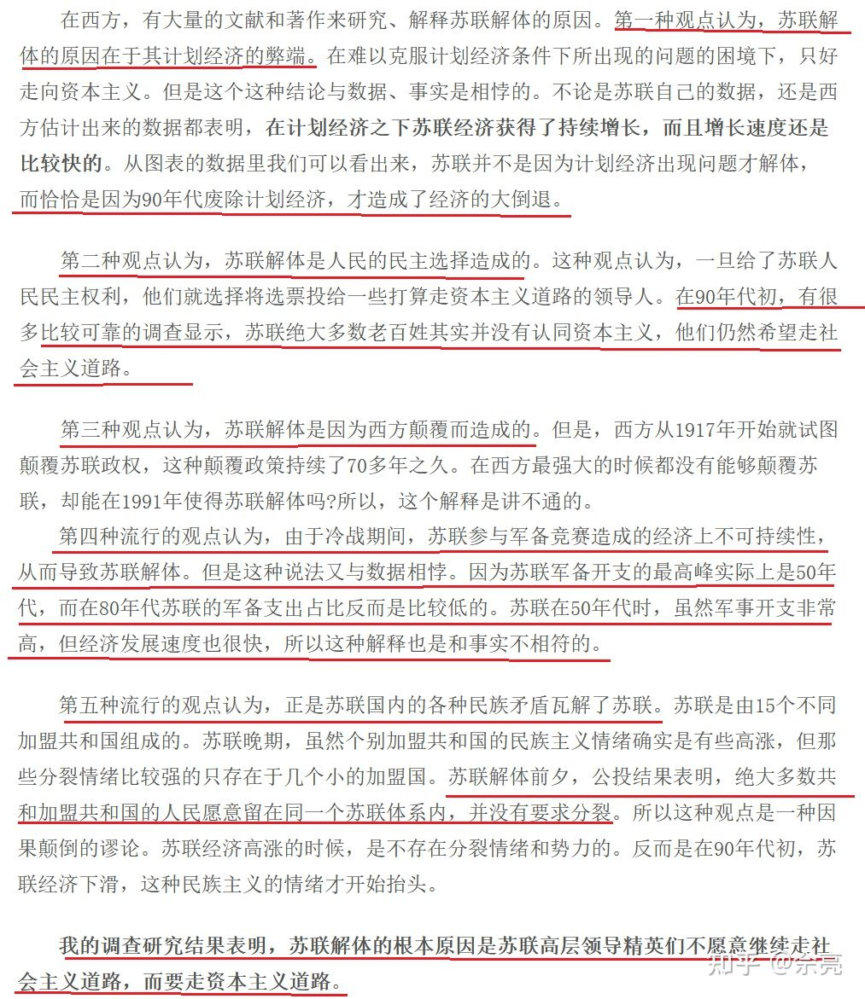
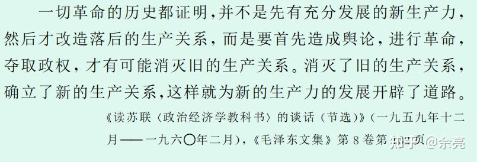
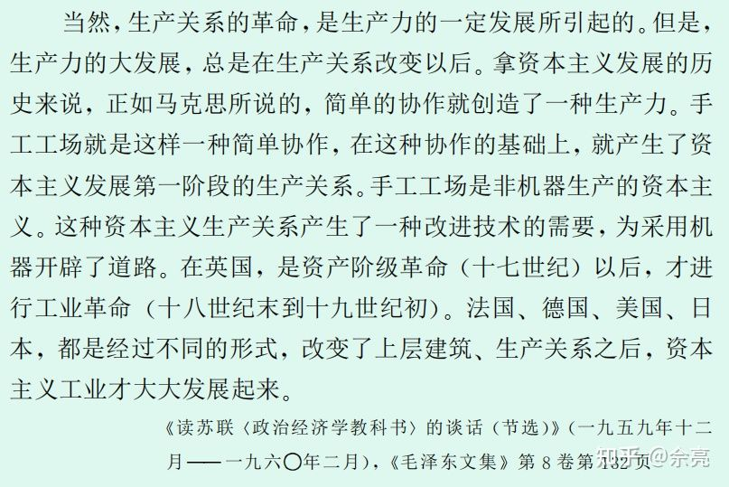
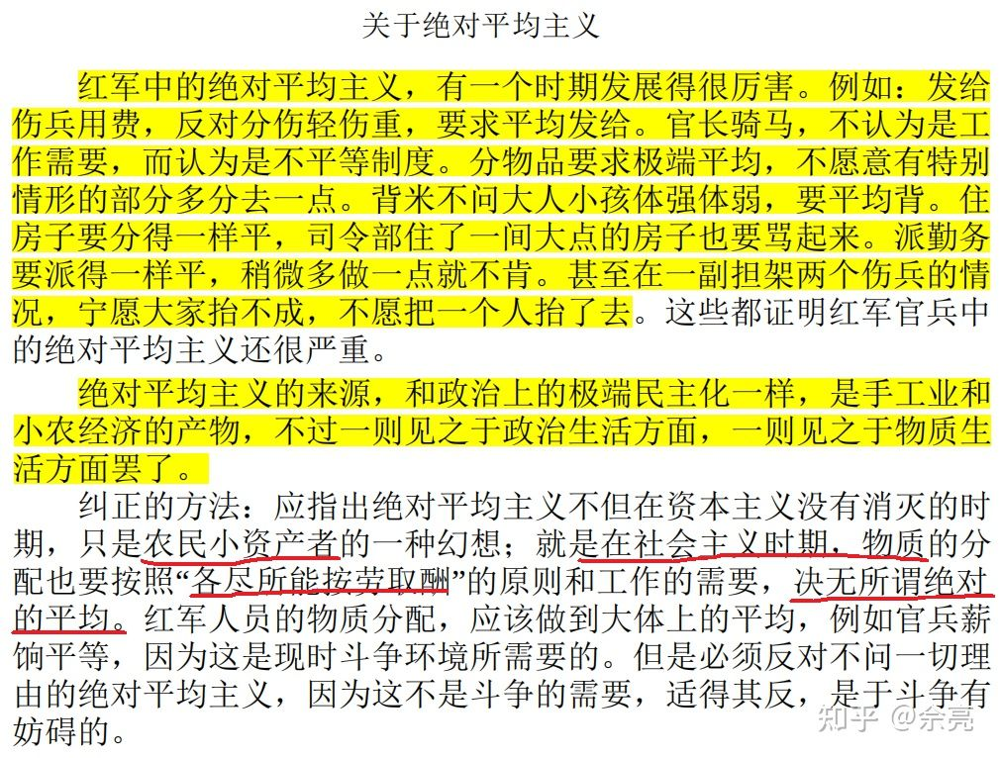
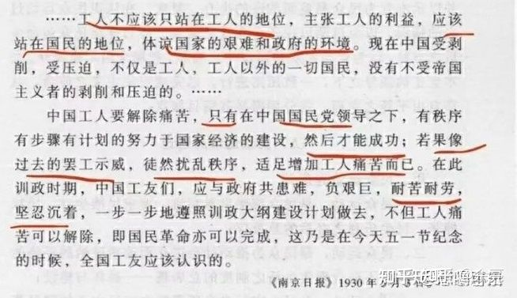

作者：佘亮  
链接：https://www.zhihu.com/question/455122141/answer/1961150959  
来源：知乎  
著作权归作者所有。商业转载请联系作者获得授权，非商业转载请注明出处。

先说结论：**私有制打击劳动积极性，阻碍生产力发展，是落后的生产关系，这是显而易见的。对此持反对观点的无非是右翼知识分子，他们对公有制提出各种诘难，殊不知，这些问题在私有制下只会更甚。**

（一般来说，国内的左翼指马克思主义，右翼指自由主义和保守主义。这是一般马主义者眼中的左右划分法，但左右的划分从来都存在诸多争议，因为一维政治坐标区分不了各种主义。比如自由主义认为马主义与保守主义都主张专制，所以都是左翼；而保守主义却认为马主义与自由主义都是左翼。自由派和保守派互开右籍，小孩们可别在玩“互开左籍”的梗了，右右们也一样。另外，**马主义不是专制，自由派啥也不懂胡说八道**）

从这个回答的评论区反馈来看，姿呼还不是右翼多，而是右棍多，一群人不学无术张嘴就来，文章也不看，真的，要么去看眼科，要么去学汉字，文章不看的不要来评论区 fart。

像这种 24k 纯&&可别在来烦我了，我求你看了么？你是谁啊？太拿自己当回事了吧？get away！

---

正文开始

## 零、代号详解

因为害怕被&&，这里用了一些谐音代号，不熟悉英文的朋友可以评论区问一下他人。

布尔乔亚（bourgeois）

普若拉泰瑞恩（proletarian）

biu 肉柯爱特（bureaucrat）

克拉斯（class）

趴替（都懂的）

迪克忒特谁泼（dictatorship）

抛涡（power）

白钠（exploitation，也就是中文发音 “拨靴”，白钠取自“白拿”的谐音）

玛科塔经济（market economy）

## 一、李民骐对金立扬的驳斥

（李民骐的这本书书名很冲，我不敢写，感兴趣的自己找）

> 厉以宁教授的嫡传弟子金立扬在自由派知识分子的刊物上撰文说：  
> 公有产权当然有它的缺点。第一便是搭便车。公有制下形成大锅饭，人人都希望别人去努力，自己坐享其成，结果是大家都不努力。一个和尚跳水吃，三个和尚没水吃。要解决这个问题，就要大家达成一项协议，商定如何测量每个人的贡献，又如何按贡献分配收益。这是一项很费时间和精力的工作，做这项工作的人本身也要别人费时间和精力来监督，由此产生出来一大堆交易费用。第二是公有产权要对外交易的时候，内部先要统一意见，协调（短期和长期的利益）费用相当高。第三，如威廉姆森所说，私人比较注意协调短期和长期的利益，念念不忘给子孙留下一份遗产，但公有产权中，这一代人往往不顾下一代人，造成短期行为。第四是资源枯竭，公家的东西不拿白不拿，不用白不用。海洋中的鱼，不捞白不捞，结果就是过度捕捞，渔业资源枯竭。（《边缘》，14－15）

总结一下：（1）搭便车与监督费时费力（2）对外交易费用高（3）短视（4）浪费资源。下面开始反驳：

### 1、针对搭便车和监督的问题。摘录如下：

现代社会化大生产，客观上要求许多劳动者联合起来共同劳动，只有这样才能驾驭规模巨大的现代生产资料，才能发挥集体的协作的生产力，才能充分发展和利用社会分工。既然现代生产是集体劳动、联合劳动，那么无论“私有产权”还是“公有产权”，不是都需要解决“如何测量每个人的贡献，又如何按贡献分配收益”的问题吗？不是都需要“费时间和精力来监督”吗？美国学者萨缪尔·波利斯通过研究发现，美国非农业领域监督工人与生产工人的比例，1948 年是 13.7%，1966 年上升到 20％，1979 年又上升到 22.4%。不仅如此，资本主义监督要起作用，还必须维持一支庞大的劳动后备军，从而对在业工人起威慑作用。五、六十年代，美国的失业率一般在 4－5％，七十年代上升到 6％，八十年代又上升到 7－8％。仅此两项，就浪费社会劳动的四分之一！这还不是“一大堆交易费用”吗？

美国工人从他们的切身经验中深知，如果发挥了他们在提高生产方面的创造力，这很可能意味着多做工作而报酬却依然如旧，或甚至更少些。三十五年之前，我曾在一家钢铁厂工作过，在那里工作的我所认识的大部分机工能操作得比资方的工序时间测定员所规定的时间快百分之十五到百分之三十。但是，他们不愿作傻瓜，他们保持这一秘密，他们不去增加军火生产，而是为自己在工作时间里安排了更多的空闲休息时间……在美国工人中蕴藏着巨大的智慧和创造力量，对此，私营企业的经理人员无法把这股力量挖掘出来。（《外国历史哲学经济摘译》总 22 期，“在漫长的劳动日中消磨一生”）

经济学家们热衷于批评苏联式中央计划经济，说计划当局不可能收集到充分的、准确的信息。殊不知，资本主义企业面临的困境是一样的。资本家要靠工人进行生产，所以在有关生产的信息上也只好依赖工人。但是工人是被雇佣的，他有什么必要向资本家提供充分的、准确的信息呢？他为什么不努力歪曲真相使自己得到好处呢？既然如此，“私有产权”又怎么能解决“搭便车”问题呢？

马克思主义理论认为，工人卖给资本家的不是“劳动”而是“劳动力”，这是不是咬文嚼字呢？根本不是。早在十八世纪就有人指出：“你可以迫使一些人为了一定的工资劳动若干小时，但是你无法迫使他们认真工作。”美国最高法院在 1898 年侯顿诉哈丁一案的判决中指出：“企业主和劳动者的地位是不平等的，他们的利益在某种程度上是相冲突的。前者必然希望能从雇员那里获得尽可能多的劳动，而后者由于害怕解雇被迫服从（前者的）规章制度。这些规章制度，按照后者的正当意见，对后者不利。……也就是说，企业主制定规则，而劳动者实际上被迫遵守这些规则。”(Perelman,1991,59,98)

如果劳动可以被买卖，为什么还要制定规章制度以“获得尽可能多的劳动”呢？所以，买卖的不是劳动，而是劳动力，工人得到的不是劳动的报酬，而是劳动力的价格。如果工人不得不“尽可能多的劳动”，那么工人就会被剥削。但是，资本家是不是真的能剥削工人，剥削多少，这都不是在买卖“劳动”的过程中能决定的，而只有通过工人与资本家在生产领域的实际斗争才能决定。

马克思曾经指出：“（资本家）必须亲眼看见工作进行的一切正常、井井有条，看见他想要的使用价值确实顺利地从生产过程中生产出来。在这个问题上，资本家的监督能力和执行纪律能力是决定性的。而且，他必须要保证生产过程连续不断、不受干扰，并且确实在特定劳动过程及其客观条件所允许的时间范围内把产品生产出来。”(Perelman,1991,60)

所以，资本家为了保证工人能高效率地劳动、负责地劳动、正确地劳动，必须建立一套强制性的管理制度。因为工人作为被雇佣者，也是被剥削者，不会自动按照资本家所期望的方式进行劳动。

M.赖希指出：一旦接受了雇佣关系，工人就不仅向资本家放弃了怎样做工作的决定权，而且还放弃了几乎全部的作为国家公民的政治权利和公民权利。他们一走进工厂和办公室，就成了资本家的私人财产，权利法案所规定的人权保障就都不起作用了。言论和集会自由，无罪推定，法律面前人人平等，和其他保护公民免受国家侵犯的权利，统统不起作用了。(Perelman,1991,98)

资本家只有靠强制才能使工人接受剥削。但是强制本身并不能保证资本家能有效率地剥削工人。因为，资本家必须依靠工人才能完成生产过程，因此关于生产过程的信息很大部分就掌握在工人手里。资本家不了解生产过程的关键信息，也就不可能有效地剥削工人。所以，随着资本主义生产关系的发展，资本家不断按照自己的需要改组生产过程，把生产过程的关键信息掌握在自己手里，使工人失去对生产过程的控制能力。这可以用数控机床自动切削金属以制造机器来加以说明。这些机床的运转不是由靠体力操纵的熟练机工来进行的，而是由磁带上的程序自动控制的。它们可以在不影响机工的控制和技术的发挥的条件下，提高他的效能。因为编制程序所需要的金属切削知识是机工所掌握的技术的一部分，……但是在资本主义关系中，这一过程为破坏熟练技术从而压低所分解成的许多小工序的劳动力价格提供了机会，而这正是资方梦寐以求的。（阿罗诺维奇，397）

资本主义的技术发展过程，同时也是劳动者精神和智力退化的过程。劳动者越来越丧失关于生产过程的知识，越来越退化为只能从事简单的重复性劳动的机器体系的辅助人员。在资本主义的先进机器体系中凝聚了最现代的科学技术知识，但是绝大多数人民却被剥夺了智力发展的机会。但是，从长期来说，人的全面发展的生产力，人对世界的理解是比凝聚了先进技术的物质财富更重要的生产力。

资本主义生产关系因而实际上也就是资产阶级和无产阶级之间剥削和被剥削、统治和被统治、压迫和被压迫的关系，资本主义生产力的发展是建立在人的异化的基础上的。但是工人毕竟是人，是活生生的社会主体。“如果工人感到被剥削，他们就要想办法找回心理平衡。”据美国司法部统计，有三分之二以上的美国工人都参与过破坏生产的活动。在抽样调查中，有三分之一的被调查者承认曾盗窃过雇主的财物。“在小范围抽样中，通过深入交谈发现，工人这样做是因为他们感到被剥削，而不是由于紧迫的经济需要。”(Perelman,1991,114)

资本主义生产关系既然造成人的异化，就不得不寻求办法以缓解异化对于生产力的破坏作用。F.M.舍雷尔发现，大企业往往支付高工资，以弥补大企业工人较强烈的异化感。(Perelman,1991,113)但是，单纯靠高工资肯定不能抵销异化的破坏作用。要尽可能减少工人对生产的破坏，还必须依靠社会强制。资本主义的社会强制制度有两种类型：

（1）企业内强制。资本主义企业通过规定劳动纪律.设置监督人员和惩罚性措施直接强制工人按照资本家的要求劳动。比如，美国非农业领域监督工人与生产工人的比例从 1948 年的 13.7%上升到 1966 年的 20.0%，又上升到 1979 年的 22.4%。(Perelman,1991,94)企业内强制有一定的限度，因为工人可以通过退出企业逃避资本家的统治。所以，企业内强制必须有企业外强制配合才能充分起作用。

（2）企业外强制。首先，资本主义通过经常保持一支失业队伍为资本家提供劳动后备军，而工人因为害怕失业只有忍受资本家的压迫。其次，为了防止工人造反，资本主义国家建立了社会福利制度。但是社会福利并不能保证工人过上社会公认的正常生活水平，从而迫使工人为了过正常水平的生活必须出卖劳动力，为资本家干活。所以，资本主义生产关系的正常运转，离不开企业内外的社会强制制度。

official 学者承认：“80 年代以来，我国企业管理中奉行一种较为严格的带有惩罚性的管理体制，用罚款做为管理基本手段的现像比较普遍。”（李强，173）

全国总工会在调查中发现：郑州一单位制定 124 条规定，其中有 4 条是奖励条例，其余 120 条均为罚款条例。该单位还规定车间干部、班长等每人每月必须逮住三至五起违纪事件。组长每人必须逮住一件，逮不住罚款，少逮了扣奖。……陕西一个织布车间对各岗位工人制定的罚款条文有三万多字。山西、丹东、上海、南昌、郑州、浙江等地一些企业的职工反映，厂里和规定看病扣钱，休病假、公伤扣钱，有病假未经领导批准就休病假算旷工，重罚。（李强，171）

official 学者认为：“80 年代以来的较为严格、严厉的管理制度，确实对于恢复企业生产秩序起了重要作用。”（李强，173）按照资产阶级经济学的逻辑，劳动者是天生懒惰的，要让劳动者劳动，必须提供懒惰的成本，用失业、竞争、罚款强迫劳动者干活。但是，劳动者既然是活生生的人，他就不可能任人摆布，而要拼命显示自己作为人的存在：

有的工人说：“你罚吧，别的权利我没有，消极怠工权、浪费权我有”，“你罚我五元，我让你十倍、百倍地偿还”。……工人情绪低落，积极性受到挫伤，工作没劲头，有的甚至消极怠工，给企业生产带来不利影响。山西阳泉煤矿原来出勤和生产状况很好，由于扣罚过多，曾造成该矿出勤下降，事故上升，产量下跌。（李强，174）

即使是资本主义生产关系，也不能不依赖于劳动者最低限度的参与。如果劳动者没有一点对工作的责任心，任何强制手段也不能使资本主义的生产力发展。但是，正是资本主义生产关系本身排斥了劳动者对生产资料的占有、对劳动成果的支配，把劳动过程变成了劳动者退化的过程。因此，在资本主义生产关系中，劳动者只是一个纯粹被动的被支配的“物”，只有在资本主义制度的强制下，他们才会干活。这必然导致阶级对抗，破坏生产力。

official 学者认为：“惩罚的方式在有些情况下是必要的，因为对于最低道德水平或无道德水平的人来说，其他方式均不起作用。”制造“最低道德水平”的正是资本主义生产关系。在这种生产关系中，人不算作人，而仅仅是商品，是在生产过程这要努力节约的成本。

### 2、针对交易费用高，摘录如下：

“第二是公有产权要对外交易的时候，内部先要统一意见，协调费用相当高。”土地私有者如果要转卖土地，自然不需要与这块土地上的居民“协调”。如果把居民区改做商业区，致使这块土地上的居民流离失所，这些损失自然也不需要土地私有者花费分文。如果资本家开除工人，使之生计无着，自然也不需要任何“协调费用”。说到“公有产权”，那么今日中国在大炒特炒房地产的时候，又何需为当地居民付出任何“协调费用”呢？“私有产权”不必事先付出协调费用，就是说，这种费用要转嫁给别人，就是说，这种费用要采取社会冲突的形式。

### 3、针对短视，摘录如下：

“第三，……私人比较注意短期和长期的利益，念念不忘给子孙们留下一份遗产，但公有产权中，这一代人往往不顾下一代人，造成短期行为。”这一条是颇有些颠倒黑白了。为什么在资本主义高度发达的今天，各国的教育、科学、文化事业也往往要由国家来承办呢？还有道路、机场、港口、通信、水利、电力事业等周期长、利润薄的事业，不也有赖于国家投资吗？不就是因为私人企业唯利是图的“短期行为”吗？如果说私人充其量能给子孙保留一笔遗产，那么只有社会才能考虑给整个社会的后代留些什么，只有社会才能从不仅是下一代人、而且是下几代人的眼光考虑这个问题。

### 4、针对资源浪费，摘录如下：

“第四是资源耗竭，公家的东西不拿白不拿，不用白不用。海洋中的鱼，不捞白不捞，结果就是过度捕捞，渔业资源耗竭。”这一条与“搭便车”实质上是同一个问题。归咎于“公有产权”却是有失公允的。“渔业资源耗竭”难道不正是私人生产者一味追逐利润的结果吗？

### 5、老工人现身说法

老工人：五十年代工人的干劲和现在大不一样，不需要物质刺激，也不用上级督促，有困难工人自己会想办法克服。这是事实，不是官方宣传。现在的经济学家对此根本不能理解，他们认为这是由于什么“强有力的集体主义意识形态”，完全是偶然的，是不能持久的。但是，他们不能够解释，为什么这样一种“意识形态”在那个时候就能够起作用，而后来却不能够起作用了。实际上，工人决不会无缘无故地热情劳动。工人告诉我，五十年代的干部关心工人，真正是吃苦在前、享受在后，“党员就是党员”，这才是工人生产积极性高涨的真正原因。

这些模糊的语言，当然缺乏资产阶级社会科学最讲究的“精确性”，但它是工人的真情实感，说明当时中国的的确确存在一种与现在根本不同的生产关系。

## 二、关于人性问题

### 1、到底什么是人性？

右右们反驳公有制计划经济的最烂大街的理由就是“人性”，多新鲜啊，你们当 Marx 是书呆子么？**你们都能想到的事 Marx 就想不到？**Marx 原文怎么说的——

> 费尔巴哈把宗教的本质归结于人的本质。但是，人的本质不是单个人所固有的抽象物，在其现实性上，它是一切社会关系的总和。  
> 费尔巴哈没有对这种现实的本质进行批判，因此他不得不：  
> （１）撇开历史的进程，把宗教感情固定为独立的东西，并假定有一种抽象的——孤立的——人的个体。  
> （２）因此，本质只能被理解为“类”，理解为一种内在的、无声的、把许多个人自然地联系起来的普遍性。 —— 《关于费尔巴哈的提纲》第六条

右右们看不明白是吧？莫焦急，看看另一位是怎么解释的——

> “人性论”。有没有人性这种东西？当然有的。**但是只有具体的人性，没有抽象的人性。在阶级社会里就是只有带着阶级性的人性，而没有什么超阶级的人性**。我们主张无产阶级的人性，人民大众的人性，而地主阶级资产阶级则主张地主阶级资产阶级的人性，不过他们口头上不这样说，却说成为唯一的人性。**有些小资产阶级知识分子所鼓吹的人性，也是脱离人民大众或者反对人民大众的，他们的所谓人性实质上不过是资产阶级的个人主义，因此在他们眼中，无产阶级的人性就不合于人性。**—— 第三卷《在延安文艺座谈会上的讲话》

这位讲的话从来都是那么平实易懂，但是右右们你们真得懂了么？你们能达到正常人的理解力么？为了帮助你们理解，我问你们一个问题：什么是你们口口声声讲的人性？

你们可能会回答：那还用问么？**钱权色**就是人性啊，这傻子都知道……

那么，请先回想一道小学自然课上的化学题：为什么水能灭火？——难道这个问题的回答是——那还用问么？水就是能灭火啊，傻子都知道……

不好意思，傻子不知道，科学和哲学总是要超越日常经验去探求事物背后的道理，难道你想当一个傻子，认为一切都是理所当然的吗？

上来就讲“人性自私”的恰恰就是这种不加思考就**独断**地认为人性是一个**抽象的、孤立的、内在的、无声的、普遍的东西**，问题是：凭什么？凭你的日常经验？从你的经验来看太阳、月亮、星星都围绕地球转，那地心说就是对的？

所以当你们大谈特谈人性之前，请先退一步，思考一下人性到底是什么？这是你们观点立论的基础，如果没有这个基础是上不了台面的。

左翼关于这个基础的观点就很明确——人性是不存在的，是被社会所结构的，不同的社会关系会制造不同的貌似彰显着人性的行为——你可以说这些行为（也就是所谓具体的人性）是存在的，但你往回倒推那个抽象的人性是不行的。**所谓的钱、权、色、自私等不是什么人性，而是被社会塑造的意识形态。**为什么社会会塑造这些意识形态呢？——到这里，终于提出了有价值的问题，即从“人性”这种现象出发，回到了社会批判。当然，各位都比较熟悉左翼对于这类问题的观点，那就是 克拉斯斗争。因为 克拉斯 的分化，社会会产生不同的人性观点，有**布尔乔亚**的人性、**小布尔乔亚**的人性和**普若拉泰瑞恩**的人性，**大家的人性都不一样，但是掌握舆论的布尔乔亚、小布尔乔亚总是喜欢用自己的人性来代表全人类的人性，这是一种无知和自大。**

### **2、右右们的人性是什么？**

因为左翼认为人性不存在，所以这里与其说“右右的人性”，不如说“右右的意识形态”。讲右右的意识形态就要从 克拉斯意识、克拉斯的划分入手。（克拉斯意识是一个很大的话题，可以讲很深，但笔者水平有限，这里只说最浅层的，感兴趣的读者可以自行研究）

从克拉斯划分上，右右大致可分为 布尔乔亚、小布尔乔亚、**biu 肉柯爱特，**那么他们的意识形态都是什么呢？

对于布尔乔亚来说，虽然也分成大中小等各个不同体量和等级的布尔乔亚，但他们普遍都倾向于自由主义，在他们眼里，趴替是 **迪克忒特谁泼**（dictatorship），他们觉得自己受委屈了，被**抛涡**压制了。但他们却矢口否认自由市场下雇佣劳动制本身就是**抛涡**的一种，**白钠**就是**抛涡**的体现。

对于**biu 肉柯爱特**来说，最重要的是找个意识形态把所有人都缝进来，比如 nationalism，因为这一方面被用来解释历史问题，另一方面意味着缓和**克拉斯矛盾**，将不同克拉斯的人都纳入同一个共同体当中。当然，他不是中立的，剩下的笔者就不敢多说了。

小布尔乔亚**不是指**小的布尔乔亚，而是指既不被他人白钠，也不白钠他人的人。比如小作坊主、小商贩、自耕农等。**一些小知识分子，从生产关系上讲，不能算是小布尔乔亚，而应该是脑力普若拉泰瑞恩，**但是他们不自知，脑子里装的是小布尔乔亚的意识形态。而小布尔乔亚的思想本来就是零散、混乱的。有的人十分爱国，有的人逢中必反，有的人坚持公有制，有的人希望私有化，有的人推崇社会达尔文主义，有的人要求平等公正。

右右们的意识形态是怎么形成的呢？左翼的观点认为是生产力、生产关系、克拉斯斗争是主要原因，但右右们不想承认自己在**白钠**，所以他们不喜欢左翼叙事，他们把一切都归结到一个抽象的人性上，但他们却从来都不想继续解释解释人性到底是个什么？

笔者浅薄的观点认为，他们将人性描述成**自私、贪婪、懒惰、好色**的抽象实体，言外之意是将人性等于动物性，将人类社会比作动物生活的丛林，也就是喜闻乐见的庸俗社会达尔文主义—— 一种试图以碰瓷达尔文进化论来解释人性到底是什么的想法。对这个的批判随处可见，笔者就不赘述了。

总结一下，右右们因为生产关系的原因，会产生克拉斯意识形态，为了解释这些克拉斯意识形态，他们构造了一个**自私的、贪婪的、懒惰的、好色的抽象人性**出来，为了解释这个抽象人性是怎么回事，他们开始了碰瓷达尔文的表演。

### 3、普若拉泰瑞恩 的人性是什么？

需要澄清一个误解，总有人认为公有制计划经济**要求**人们不能自私，要求人人都无私奉献，**这是不对的**，这是右右们企图用他们的叙事方式来污蔑 socialism 的话术。

socialism 并不会**要求**人们无私，要求是一种命令，是**抛涡。**真正的 socialism 是人们日益趋向于无私奉献，为什么会这样？因为这伴随着社会生产关系的改造，如果一个人没有生计的忧虑、没有被抛涡压制、没有被社会抛弃，那么他将更倾向于为他人做一些好事。所以左翼的愿景是通过改造社会，来促使人们逐渐自发形成乐于助人的意识。

比如雷锋同志，雷锋不是毫无原则的老好人，雷锋明确讲过：“对同志要像春天般温暖，对敌人要像寒冬般无情！”，谁是雷锋的敌人？—— 雷锋的父亲，参加过湖南农民运动，被 KMT 抓去毒打致残，1944 年又遭到日寇毒打，翌年去世；雷锋的哥哥，十二岁外出当童工，在繁重劳动的折磨下得了肺结核，一天，突然昏倒在机器旁，轧伤了胳膊和手指，被解雇后又到了一家印染作坊当童工，由于劳累过度，肺病加重，又无钱医治，没几天就死了；雷锋的弟弟，因为饥饿而死；雷锋的母亲，被当地地主凌辱而上吊自杀。——雷锋在不满 7 岁就成了孤儿！

所以什么是 **普若拉泰瑞恩** 的人性？要理解 普若拉泰瑞恩 的人性要从 普若拉泰瑞恩 所面对的现实出发，普若拉泰瑞恩 所面对的从来不会是什么声色犬马、什么骄奢淫逸。而是要像雷锋同志及其家属一样面对 996、007、过劳死、中年失业、房价高企、教育、医疗、养老……当你面对这些问题的时候，你想的是什么？当然是改变，当然是干掉让别人白钠你劳动成果的生产关系！所以从这一点上说，**普若拉泰瑞恩在玛科塔经济中也必须要自私，**你不自私，你无私奉献，牺牲自己，照亮布尔乔亚，这才是没有逻辑的，不正常的。所以右右们把“自私不自私”的问题当成是一个固定的、单一维度的、静止的问题来解读，本身就是相当愚蠢的。

**普若拉泰瑞恩** 除了要求改变之外，还要求守住，比如苏联后期 **biu 肉柯爱特** 背叛了 people，有人就嚷嚷着这是 人性自私的胜利，无人能挡。但是不好意思，这是 **biu 肉柯爱特的自私** 的胜利，同时也时 **普若拉泰瑞恩的自私** 的失败。谈论自私还是不自私的问题，不能离开屁股，自私就是指忠于自己的屁股，苏联的普若拉泰瑞恩没有忠于自己的屁股，将自己无私奉献给了 **biu 肉柯爱特** 。

### 4、人的欲望总是他者的欲望

有人觉得以上对于“人性”的解读含左浓度太高，那么推荐你去学习拉康派精神分析，拉康本人不是左翼，没有什么含左不含左的。他们认为自我意识是社会赋予你的，甚至认为性别意识都是后天构建的，而人的欲望总是他者的欲望，也是被社会构建的。不存在什么人的本质、人性的问题。

关于拉康镜像理论：

[精神分析入门——Lacan 镜像自我\_哔哩哔哩\_bilibili​www.bilibili.com/video/BV1Ff4y1h7zY](https://www.bilibili.com/video/BV1Ff4y1h7zY)

[精神分析入门——疯狂的自恋\_哔哩哔哩\_bilibili​www.bilibili.com/video/BV12h411a7ni](https://www.bilibili.com/video/BV12h411a7ni)

## 三、请复习高中政治，私有制下的工资不是按劳分配！！！

高中政治讲公有制下才是按劳分配（注意区分公有制与国有制，笔者认为后者仍然是私有制），私有制下是按生产要素分配下的劳动收入。明确指出其不是按劳分配。那么为什么不是按劳分配呢？

[佘亮：资本家和工人谁更贪婪？谁更懒惰？谁在追求不劳而获？​zhuanlan.zhihu.com/p/385182620](https://zhuanlan.zhihu.com/p/385182620)

因为有些人压根不会点开链接，这里写个简短摘要：

_工资不是按劳分配的，工资是劳动力的价格（需要区分劳动与劳动力），影响劳动力价格的因素包括（1）劳动力的价值（也就是维持劳动力再生产的花销）；（2）社会习俗；（3）市场供需；（4）工人抗争。_

_为什么会有工资倒挂？因为新员工的工资随着市场趋势水涨船高，而老员工没参与劳动力市场，巴望着老板看你劳苦功高而给你涨工资是水中捞月、梦幻泡影。为什么生育率全球倒数？因为劳动力再生产也包括抚育子女的费用，但工人被打压得太严重了，劳动力再生产都成了一个问题，结果就是生育率倒数。_

## 四、苏联是公有制计划经济的失败？不，是苏修背叛了这一切

又是一个喜闻乐见的话题，右右喜欢用苏联解体来说明公有制计划经济搞不下去，但这并不是事实，大卫科兹是苏联问题方面的专家，他的观点如下：

对于这个问题，资产阶级知识分子（比如高华）会各种编瞎话忽悠你，让你觉得社会主义是乌托邦，是不可能实现的，苏联解体就是例证。这些纯属意识形态、思想领域的斗争，资产阶级知识分子被资本家豢养，宣扬的理论都是为资本主义本身来辩护，如果你是资产阶级阵营的，那你可能会高举这些反动理论打倒社会主义，但如果你是无产阶级阵营的，居然还被这些资产阶级思想、理论所洗脑，被学者光环所圈粉，那你这相当于羊爱上狼，相当疯狂。

## 五、唯生产力论、工业党都是老保守主义了

原评论区有人自以为是，认为“强 AI 制造”直接实现 communism，不需要 socialism 过渡（也就是不需要公有制计划经济）。对此，真的请不要信口开河。

什么是“强 AI 制造”？这位老哥有两层意思：（1）全面自动化，机器换人；（2）人都有私心，用机器（强人工智能）进行分配就能解决私心问题（还是喜闻乐见的人性问题）；

### 1、对于“全面自动化，机器换人”的问题

发展生产力当然是对的，但是落后的生产关系（私有制市场经济）阻碍了生产力的极大发展。

从生产端看，机器换人会提高资本有机构成，资本有机构成的提高会降低利润率，使私人企业失去投资欲望，资本留在金融等不产生实际价值的领域空转。

![[公式]](https://www.zhihu.com/equation?tex=%E5%88%A9%E6%B6%A6%E7%8E%87%3D%5Cfrac%7B%E5%89%A9%E4%BD%99%E4%BB%B7%E5%80%BC%7D%7B%E4%B8%8D%E5%8F%98%E8%B5%84%E6%9C%AC+%2B+%E5%8F%AF%E5%8F%98%E8%B5%84%E6%9C%AC%7D+%3D+%5Cfrac%7B%E5%89%A9%E4%BD%99%E4%BB%B7%E5%80%BC%E7%8E%87%7D%7B1+%2B+%E8%B5%84%E6%9C%AC%E6%9C%89%E6%9C%BA%E6%9E%84%E6%88%90%7D)

从消费端看，机器换人会造成失业，工人失业就会削弱消费，另一方面也会造成 society 不稳定，大他者害怕看到这种情况，所以对推进机器换人会比较消极。有人对大他者抱有幻想，认为大他者直接给失业工人发钱就好了，那么大他者从哪拿钱给失业工人发？北欧依靠高附加值产业剥削第三世界，从而缓和内部矛盾，那么赛里斯的产业升级在哪里？

从实现上看，机器换人需要工业技术进一步提升，这就牵扯到产业升级问题上了，那么为什么产业升级迟迟不能成功？

[中国当前缺乏创新根本原因是什么？956 赞同 · 147 评论回答](https://www.zhihu.com/question/27534237/answer/1942066468)

_（安生这篇文章很值得读读）_

归根结底还是落后的生产关系阻碍了生产力。

很多人不理解什么是生产力决定生产关系，有些心怀不轨的人嚷嚷着“大力发展生产力，大力发展工业文化……”，这都是嘴上打着嘴炮要发展生产力。看看毛是怎么说的？

**那些嘴上说着发展生产力就能自动进入 communism 的唯生产力论者，戏剧性地就是最阻碍生产力的人。**

### 2、强 ai 负责分配的问题

首先强 ai 远得很，根本见不到边，深度学习只是数据科学。

其次，怎么个“强”法？

（1）比人强，跟上帝一样。——哇偶，好厉害了，人不光能造机器，还能造神了。

（2）跟人一样强。——怎么保证它不是开历史倒车的坏人？

（3）比人弱，依靠计算能力、存储能力等成为人类进行经济管理的得力助手。——那不是还是与坦克、飞机、计算机一样的工具么？被人类制造，被人类管理，最终还是取决于人。

希望有个强 ai 来公平地分配，而不是人们自发地通过维护自身利益来达到公平分配，这种想法就像是古代社会期待天降明君一样，是一种保守主义意识形态。你自己的利益你都不关心，还希望有个明君替你解决问题？

所以说，一方面唯生产力论者不关心生产关系，嘴上只会叫嚷着生产力，仍然是用 nationalism 来压制克拉斯矛盾，企图稳定压倒一切；另一方面，希望科学、技术多么滴神奇，替人类解决一切问题，而不是人们自己解决**抛涡**斗争的问题。这两方面都体现了其保守主义的本质。

## 六、抽打小粉红——年轻人爱国没问题，但不要随便热泪盈眶

原回答的评论区有小蠢红出没（小粉红的评论截图我没留存）

大意上讲“向往公有制的人是向往平均主义……网友不是向往公有制，而是恨自己没有投胎到北欧……”

对此，回复是：

1、中国网民 9.89 亿，你们想代表谁？经过人家同意了么？强行代表他人是不是个人权力欲望过剩？

2、公有制和平均主义有什么关系？左翼思潮关注的是推翻压迫剥削，让劳动人民重新获得自己的劳动所得，这和平均主义沾边么？“不劳动者不得食！”，平均主义和公有制完全是两回事，将两者等同的是右翼干的事，国民党对共产党的污蔑是什么？是“共产共妻”，你们是国民党特务么？

下图是毛选中《关于纠正党内的错误思想》一文片段：

3、“你以为网友向往公有制？恨的是没投胎到北欧吧”，这句话有几层意思，这里先说第一层——道德绑架、以国家的名义绑架他人、爱国主义绑架他人。

有人认为共产主义要讲奉献，要讲为人民服务，要讲舍己为人。如果真是这样的话，那共产主义确实实现不了，是乌托邦。但问题是共产主义从来不寄希望于道德感召。“为人民服务”是毛主席的教导，但毛主席这里主要是告诫先锋队的，是对先锋队的要求，而不是对所有群众的要求，毛选第三卷《为人民服务》一文参考如下：

[为人民服务（一九四四年九月八日）​www.marxists.org/chinese/maozedong/marxist.org-chinese-mao-19440908.htm](https://link.zhihu.com/?target=https%3A//www.marxists.org/chinese/maozedong/marxist.org-chinese-mao-19440908.htm)

小蠢红们经常有一些幼稚且奇怪的言论：“美国打压中国，你们怎么不 996、007，为国奉献，为人民服务呢？”、“你们怎么不爱国呢？还是不是人了？”…… 就这种言论，能有动员力就怪了，共产党是要争取群众拥护的，而不是要挟群众拥护，国民党才拿国家大义来要挟群众，让工农无产阶级自我牺牲为国奉献。比如这张被引用了无数次的图：

而国民党这样的行为能号召得动群众么？抗日战争时期，老百姓可是帮着日本人打国军的！

当然了，不能因为一两句出格的言论就将小蠢红一棒子打倒，毕竟还有大人物犯过类似的，但更为严重得多得多的错误，后来不也平反了么，比如毛主席的这篇文章：

_（此处是文章 《坚决刹住退赔，刹住 xx 风》的截图，但上传几次都失败了，感兴趣的自己找）_

当年搞共产风的人不是蠢就是坏，为了避免“蠢”再次蔓延，这里需要分清楚几个概念，来自曼德尔《论马克思主义经济学》：

（1）**平等交换**，可以是以物易物，也可以是用商品换货币，再用货币换商品，也就是 C-M-C，（C 表示 commodity，商品，M 表示 money，货币），关键要点是等价交换。

（2）**工人阶级**，包括产业工人、脑力无产者（程序员、白领）等，在市场经济中，参与的经济循环仍然是 C-M-C，第一个 C 表示将劳动力作为商品进行售卖，你的工资并不是按劳分配，而是你的劳动力的售价，是包含有市场供需因素的。将劳动力作为商品售卖，换取货币，再用货币购买劳动力再生产的商品（吃喝睡娱等）。

实际上 C-M-C 被称为**商品流通**，支持这个循环的动力是商品的使用价值，对工人阶级来说是为了生活。与之相对应的另一个循环是 M-C-M’ 循环，这个循环被称为**货币流通**，比如

（3）2021 年了，网友们的基本马政经常识应该都补完了，显然，**资本家**参与的就是 M-C-M’ 循环，使用货币购买商品，包括机器、厂房等生产资料商品，也包括劳动力这种能产生剩余价值的特殊商品。然后进行生产，将生产出的新的商品拿到市场上售卖，获得货币 M’。M’与初始货币 M 相比而言，多出了剩余价值，即剩余价值 = M’- M。

（4）有人对“**商人**”的认知是模糊的，认为资本家是坏的，商人是好的。实际上，如果只是 C-M-C 循环进行商品等价交换，那还算不上商人，任何人都可以做到，而不必专业化经商。之所以有专门靠商业谋生的人，自然是在商业中能够赚钱来养活自己，而自己专业经商，不事生产，那是怎么交换的呢？答案是商人参与的是 M-C-M’循环，比如丝绸之路上的险恶，都不能阻挡商队，为什么？因为商人从一个地方运送商品到另外一个稀缺此商品的地方进行交换，必然是不等价交换，必然能从交换中赚取剩余价值，否则商人也不会冒生命危险去组建远行的商队。

所以货币流通（M-C-M’）与商品流通（C-M-C）的动机是不同的，商品流通是为了换取商品的使用价值，而货币流通的动机是为了积累剩余价值。

**那些动不动就指责人们对资本家羡慕嫉妒恨的人应该看清楚，到底谁在被利润驱动，是参与商品流通的工人，还是参与货币流通的资本家和商人？**

我们说在过去，市场经济撼动了封建社会的根基，此时市场经济是先进的，商人经商、资本家建厂是值得鼓励的，但是当下资本主义社会已经取代封建社会五百多年了，资本主义不断制造自己的否定因素，也就是无产阶级，是时候将资本主义送进坟墓了。为了将资本主义送进坟墓，就要消灭这些不平等的，由资本利润驱动的经济行为，所以对生活资料进行共产、对劳动人民进行强取豪夺的共产风是极右翼行为，是阶级敌人的反扑行为。

而那些用道德绑架，不懂什么是共产主义，却将共产主义吹成高道德标准，要求人人都舍己为人、无私奉献却丝毫不提经济基础的人；那些将共产主义等价于为国家做奉献，以“爱国”的名义、以“国家大义”要求他人如何如何的人。这些人都是在继承共产风始作俑者们的遗志，表面上扛着红旗，实际上干着阶级压迫的勾当。

4、“你以为网友向往公有制？恨的是没投胎到北欧吧”，第二层，崇洋媚外的问题——这位蠢红的言外之意就是你们批评祖国，和公知一个腔调，哪是什么共产主义情怀啊？分明就是崇洋媚外作祟，保不齐还是领了白灯的狗粮。

（1）在他们的理解当中，共产主义是一种情怀，是一种舍己为人、无私奉献，甘愿献出生命的情怀！——什么是学生思维？这就是学生思维！革命先烈不是为了情怀献出生命的，是残酷的阶级斗争，这是一场你死我活的斗争，不是踏马的狗屁情怀，情怀党都是小资产阶级式的自恋，看不到阶级压迫，看不到这是一场反抗压迫的斗争。他们只知道吹嘘将领们英明神武，谁赢，他们就为谁摇旗呐喊、歌功颂德。而对于失败者，他们只看到常凯申操作拉跨，却看不到“不得民心”！

（2）小粉红兔友的鲜明特征是二极管思维，批评我的就是公知，就是美分。实际上不止小粉红啦，政治上左右的划分也是典型的二极管，因为一个维度两个方向根本就不可能分开各种复杂的政治主张。比如一般来说，马主义会认为自由主义和保守主义都是右翼，而自由主义认为保守主义是左翼，保守主义认为自由主义是左翼。小粉红、兔友脑袋比较奇怪，自己明明是保守主义的思想，却要披着马主义、毛主义的外皮，自认为左翼，将一切对立面都打成自由派。

（3）逆向民族主义的问题。

总有人觉得之前搞逆向民族主义太严重了，外国人都骑在脑袋上拉屎了，应该大搞特高民族主义，提高民族自信心，一切批评的话语都要封掉，因为当务之急是要提高民族自信力。

这种想法很幼稚，民族自信心不是靠宣传就能宣传成功的，而且否定各种批评要靠实际行动而不是谎话，因为谎话只会让批评更甚。

民族自信心是一种社会意识，而社会存在决定社会意识，社会存在中最为重要的就是生产力-生产关系构成的经济基础。其中生产力落后咱没有办法，只能是励精图治，但有些生产关系的变化不仅没有助力生产力向发达国家看齐，反而在拉后腿。比如现在吹中国崛起一直在吹 GDP，却从来不提产业升级的问题，没有产业升级，你 GDP 再高又有何用？而产业升级为什么没有成功？为什么经济会脱实向虚？为什么传统工科都成为天坑专业？这里贴几个链接，都是简单易懂，傻子都能学会的，希望你们能学习。

[中国当前缺乏创新根本原因是什么？956 赞同 · 147 评论回答](https://www.zhihu.com/question/27534237/answer/1942066468)

[【佐伊财经】20 年前的产能过剩如何影响现在的中国经济？\_哔哩哔哩\_bilibili​www.bilibili.com/video/BV1da4y1a727](https://link.zhihu.com/?target=https%3A//www.bilibili.com/video/BV1da4y1a727)

[【佐伊财经】凯恩斯主义：四万亿计划和产能过剩、企业负债、脱实入虚\_哔哩哔哩\_bilibili​www.bilibili.com/video/BV1XK4y1e7Eq](https://link.zhihu.com/?target=https%3A//www.bilibili.com/video/BV1XK4y1e7Eq)

[【佐伊财经】产能过剩能消化掉吗：凯恩斯主义的滞涨结局\_哔哩哔哩\_bilibili​www.bilibili.com/video/BV1ET4y1L7rC](https://link.zhihu.com/?target=https%3A//www.bilibili.com/video/BV1ET4y1L7rC)

[GDP 为什么一定要增长？202 赞同 · 1 评论回答](https://www.zhihu.com/question/299080438/answer/1906780037)

另外，逆向民族主义的主要来源难道不是外国人、外企的超国民待遇么？为了引进外资，国内企业需要绕道海外套个外国企业的皮再在国内投资，这逆向民族主义难道不是自己人搞出来的么？小粉红们这么爱国，怎么不去喷这个？

5、屁股决定脑袋。

在阶级社会中，一个人的思想总是要打上阶级的烙印。得承认，有一部分小粉红是年纪太小，用饭圈思维来思考政治问题，被观察者网的大国师们忽悠得失去理智，在一定的年纪下，对学者们的盲目崇拜是情有可原的，大学生、高中生、初中生甚至小学生讨论政治都没什么不好，但还是希望能多学习学习。

[观察者网和华尔街资本 \- 乌有之乡 ​www.wyzxwk.com/Article/shidai/2015/01/335970.html](https://link.zhihu.com/?target=http%3A//www.wyzxwk.com/Article/shidai/2015/01/335970.html)

但另一部分人明显就不是年纪问题，根本上就是所属阶级立场的问题。当然，能在网上为了政治问题嚷嚷的，显然也不是什么达官显贵之家，只是小资产阶级和中产阶级罢了。

从生产方式上讲，中产阶级是不存在的，中产阶级只活在人们的观念之中，比如一线城市中产阶级的门槛是很高的，而三四线教师、医生、公务员等有编制工作的也都是当地的中产阶级，三四线的中产阶级二代也是伴随着优越感长大的，在没有纵览社会全貌的时候容易陷入盲目自信、盲目野心的状态。

而臭名昭著的 F 主义则是从动员小资产阶级以反对无产阶级的运动中生长出来的，F 主义显著特点就是以 nationalism 压制阶级矛盾，常凯申领导的民国就是 F 主义。F 主义不可能让你“入关”成功，只能让你彻底失败，前车之鉴视而不见，屁股决定脑袋，不管后面的洪水滔天。小粉红、兔友们从单纯的爱国变得臭名昭著不是没有原因的。

## 七、有人说我内涵赫鲁晓夫

赫鲁晓夫怎么样我不知道，不要问我，我推荐你们看看 76 年的红旗，那些自认为自己很爱国的人看看一看洋 x 哲学那篇。

[红旗 ​www.mzdbl.cn/maoxuan/wenxian/hq/index.html](https://link.zhihu.com/?target=http%3A//www.mzdbl.cn/maoxuan/wenxian/hq/index.html)

## 八、公有制还是国有制？

有人分不清公有制还是国有制，两者是有差别的，可以参考这篇讲的关于国企改革：

[国企改革究竟改的是什么？1.4 万赞同 · 1886 评论回答](https://www.zhihu.com/question/30105824/answer/1484712593)

国有制依笔者所见，应该是 biu 肉柯爱特 所有制。
